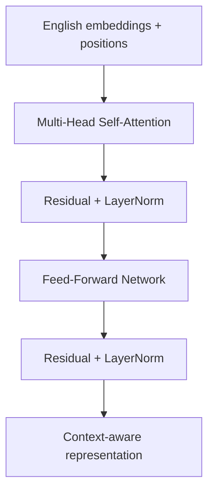
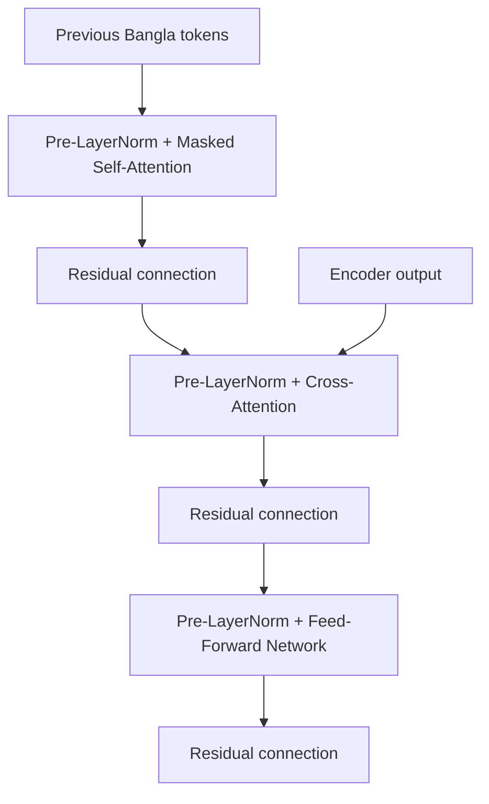
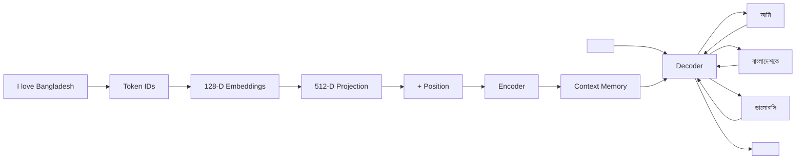

<div align="center">

# 🔤 Transformer From Scratch
### Learn the architecture behind *Attention Is All You Need* by building an English → Bangla Transformer step by step

**PyTorch · Tokenization · Word Embeddings · Positional Encoding · Multi-Head Attention · Encoder–Decoder · Machine Translation**

> A learning-first implementation that builds the important pieces of a Transformer instead of hiding them behind high-level APIs.

</div>

---

## ✨ What is this repository?

Transformers power modern language models, but the architecture can feel complicated when everything is introduced at once.

This repository breaks the Transformer into **four small, connected notebooks**. Each notebook answers one core question:

1. **How does text become numbers?**
2. **How do those numbers become meaningful vectors?**
3. **How does the model know word order?**
4. **How do attention, the encoder, and the decoder work together to translate a sentence?**

The final result is an **English → Bangla Transformer built in PyTorch**, inspired by the architecture introduced in the paper **[Attention Is All You Need](https://arxiv.org/abs/1706.03762)**.

---

## 🧠 The whole idea in one picture


A Transformer does not directly understand words.

It first converts text into **tokens**, maps tokens to **vectors**, adds information about **position**, and then uses **attention** to learn which parts of the sequence matter to each other.

---

# 📚 Learning Path

| Notebook | Main question | What you build |
|---|---|---|
| `1_tokenizer.ipynb` | How does text become model input? | English/Bangla word tokenizers, vocabularies, token IDs, padding, masks, decoder inputs |
| `2_embedding.ipynb` | How do tokens get meaning? | 128-D embeddings trained with Skip-Gram + Negative Sampling |
| `3_positional_encoder.ipynb` | How does a Transformer know word order? | Sinusoidal positional encoding from scratch |
| `4_transformer.ipynb` | How does the complete Transformer work? | Multi-head attention, encoder, decoder, training, translation, evaluation, attention heatmap |

> **Recommended order:** study the notebooks from `1 → 2 → 3 → 4`.
>
> The dependency is slightly different from the learning order:
>
> - Notebook 1 creates the tokenized data.
> - Notebook 2 trains the 128-D embeddings from that tokenized data.
> - Notebook 3 demonstrates positional encoding as a standalone concept.
> - Notebook 4 loads the tokenized data and trained embeddings, then implements positional encoding again inside the full Transformer model.

---

# ① Tokenization — Turning Language into IDs

### Notebook: `1_tokenizer.ipynb`

Neural networks cannot process raw words such as:

```text
I love machine learning
```

The first notebook creates a word-level tokenizer that converts a sentence into integers:

```text
I      love      machine      learning
↓       ↓           ↓             ↓
17      42          108           76
```

The notebook builds separate vocabularies for **English** and **Bangla** and introduces four special tokens:

| Token | Purpose |
|---|---|
| `<PAD>` | Makes sequences in a batch the same length |
| `<UNK>` | Represents a word missing from the vocabulary |
| `<BOS>` | Marks the beginning of a sentence |
| `<EOS>` | Marks the end of a sentence |

### What happens inside?

The notebook implements:

- an object-oriented **word tokenizer**
- a parallel English–Bangla corpus loader
- PyTorch `Dataset` objects
- dynamic batch padding
- padding masks
- loading the existing `train`, `validation`, and `test` splits from the dataset
- vocabulary fitting using the **training split only**
- encoding and decoding verification
- reusable tokenized outputs

A target sequence is also shifted for decoder training.

```text
Target:
<BOS> আমি ভালো আছি <EOS>

Decoder input:
<BOS> আমি ভালো আছি

Expected output:
আমি ভালো আছি <EOS>
```

This teaches one of the most important ideas in sequence generation:

> The decoder learns to predict the **next token** using the tokens that came before it.

---

# ② Word Embeddings — Turning IDs into Meaningful Vectors

### Notebook: `2_embedding.ipynb`

Token IDs are only labels.

The number `42` is not mathematically more meaningful than `17`, so the model needs a continuous representation:

```text
token ID
   ↓
[0.14, -0.82, 0.31, ..., 0.47]
        128 dimensions
```

This notebook trains **128-dimensional English and Bangla embeddings from scratch** using Skip-Gram Negative Sampling with a **context window of 2** and **5 negative samples**.

### Skip-Gram intuition

Words appearing in similar contexts should develop similar vector representations.

For a sentence such as:

```text
I love deep learning
```

with a small context window, `love` may learn from neighboring words such as `I`, `deep`, and `learning`.

The training task distinguishes:

```text
(center word, real neighbor)   → high score
(center word, random word)     → low score
```

This is implemented with **Skip-Gram Negative Sampling**.

### What is built?

Instead of relying on `nn.Embedding`, the notebook manually creates the embedding lookup using:

```python
nn.Parameter
```

It then:

- creates positive center–context pairs
- samples negative words
- trains English and Bangla embeddings independently
- plots training loss
- saves embedding checkpoints
- reloads and validates them
- uses cosine similarity to inspect nearby words

The output is a pair of reusable matrices:

```text
English vocabulary × 128
Bangla vocabulary  × 128
```

These matrices become the starting token representations used by the final Transformer.

---

# ③ Positional Encoding — Teaching the Model Word Order

### Notebook: `3_positional_encoder.ipynb`

Self-attention looks at relationships between tokens, but by itself it does not inherently know whether a token is first, second, or tenth.

Consider:

```text
Dog bites man
Man bites dog
```

The words are similar, but the order completely changes the meaning.

The Transformer therefore adds a **position vector** to every token embedding.

```text
Final representation
        =
Token embedding
        +
Position encoding
```

This notebook implements the sinusoidal encoding proposed in *Attention Is All You Need*:

$$
PE_{(pos,2i)} = \sin\left(\frac{pos}{10000^{2i/d_{model}}}\right)
$$

$$
PE_{(pos,2i+1)} = \cos\left(\frac{pos}{10000^{2i/d_{model}}}\right)
$$

### Why sine and cosine?

Every position receives a unique deterministic pattern.

```text
same word + position 2  ≠  same word + position 7
```

The notebook:

- loads the trained 128-D embedding matrices
- loads the tokenized train / validation / test splits
- pads sequences to a fixed length
- creates padding masks
- performs embedding lookup
- generates sinusoidal positional encodings
- adds position information to token vectors
- exports position-aware representations
- verifies that padding positions remain zero
- demonstrates how the **same token changes at different positions**

At this point, we have both:

```text
WHAT the token is  → embedding
WHERE the token is → positional encoding
```

> **Important:** Notebook 3 is primarily an educational demonstration of positional encoding.  
> The final Transformer in Notebook 4 does **not** directly consume the saved position-aware vectors from Notebook 3. Instead, it implements its own 512-D sinusoidal positional encoding inside the model.

---

# ④ The Transformer — Putting Everything Together

### Notebook: `4_transformer.ipynb`

The final notebook connects all previous concepts into an **English → Bangla sequence-to-sequence Transformer** with approximately **22.6 million trainable parameters**.

The saved 128-D embeddings are loaded as **trainable `nn.Parameter` matrices**, allowing them to continue adapting during Transformer training.

They are projected to:

```text
embedding_dim = 128
d_model       = 512
```

and sinusoidal positional encoding is added inside the network.

The final architecture uses:

```text
Encoder layers : 3
Decoder layers : 3
Attention heads: 8
Feed-forward   : 2048
Dropout        : 0.10
Max length     : 32
Parameters     : ~22.57M
```

---

## 🔎 Multi-Head Attention

Attention is the central idea of the Transformer.

For every token, the model creates three representations:

```text
Query (Q)  → What am I looking for?
Key   (K)  → What information do I contain?
Value (V)  → What information should I pass?
```

Scaled dot-product attention is:

$$
Attention(Q,K,V)
=
softmax\left(
\frac{QK^T}{\sqrt{d_k}}
\right)V
$$

Intuitively:

```text
Query × Key
    ↓
How relevant is every token?
    ↓
softmax
    ↓
attention weights
    ↓
weighted combination of Values
```

Instead of performing this once, **multi-head attention** performs several attention operations in parallel.

```text
Input
 ├── Head 1 ──┐
 ├── Head 2 ──┤
 ├── Head 3 ──┤── Concatenate → Linear projection
 └── ...    ──┘
```

Different heads can learn different relationships in the sentence.

The implementation performs:

- Q, K, and V projections
- head splitting
- scaled dot-product attention
- masking
- attention-weight calculation
- head concatenation

without using `nn.MultiheadAttention`.

---

## 🏗️ Encoder

The encoder reads the English sentence and creates context-aware representations.



In self-attention:

```text
Q = K = V = encoder representation
```

Every English token can therefore learn which other English tokens are relevant to it.

The repository stacks **three encoder layers**.

---

## 🧩 Decoder

The decoder generates the Bangla translation one token at a time.

Each decoder layer contains three main sublayers:



### Masked self-attention

During training, a target token must not see future answers.

```text
Token 1 → can see token 1
Token 2 → can see tokens 1–2
Token 3 → can see tokens 1–3
```

This is enforced using a **causal mask**.

### Cross-attention

The decoder must also look at the English input.

Here:

```text
Query  → Decoder
Key    → Encoder
Value  → Encoder
```

This is how the generated Bangla sentence stays connected to the source English sentence.

---

## ⚙️ Position-Wise Feed-Forward Network

After attention shares information between tokens, every position passes through the same feed-forward network:

```text
Linear
  ↓
GELU
  ↓
Dropout
  ↓
Linear
```

Attention handles **token-to-token interaction**.

The feed-forward network performs a deeper **per-token transformation**.

---

# 🔄 Complete Translation Flow

Suppose the input is:

```text
I love Bangladesh
```

The pipeline becomes:



Generation continues autoregressively until `<EOS>` is produced or the maximum sequence length is reached.

---

# 🎓 Training

During training, the model uses **teacher forcing**.

Rather than feeding its own previous prediction at every training step, the decoder receives the correct previous target token.

```text
Input  : <BOS> আমি বাংলাদেশকে ভালোবাসি
Labels : আমি বাংলাদেশকে ভালোবাসি <EOS>
```

The repository tracks:

- cross-entropy loss
- perplexity
- non-padding token accuracy
- validation loss
- BLEU-4
- exact-match accuracy

Training also includes:

- batch size: **32**
- maximum epochs: **30**
- dropout: **0.10**
- label smoothing: **0.10**
- gradient clipping
- `ReduceLROnPlateau` learning-rate scheduling
- early stopping
- saving the **best checkpoint based on validation loss**
- restoring the best model before final evaluation

The notebook does **not** save a separate "latest checkpoint" after every epoch; the checkpointing logic is focused on the best validation-loss model.

---

# 📊 Attention Visualization

The final notebook also visualizes attention as a heatmap.

This makes the core mechanism less abstract: instead of only seeing equations, you can inspect **which tokens receive attention while the model processes a translation**.

Conceptually:

```text
                 English tokens
              I     love   Bangladesh
Bangla   আমি       ███      ░        ░
tokens   ভালোবাসি   ░      ███       ██
         বাংলাদেশ   ░       ░       ███
```

Darker cells represent stronger attention relationships.

---

# 🗂️ Repository Structure

```text
transformer-from-scratch/
│
├── corpus/
│   └── Source corpus used by the project
│
├── notebooks/
│   ├── 1_tokenizer.ipynb
│   │   └── Text → vocabulary → token IDs → padding/masks
│   │
│   ├── 2_embedding.ipynb
│   │   └── Token IDs → learned 128-D word vectors
│   │
│   ├── 3_positional_encoder.ipynb
│   │   └── Word vectors + sinusoidal position information
│   │
│   └── 4_transformer.ipynb
│       └── Encoder + Decoder + attention + training + translation
│
├── tokenized_data/
│   └── Tokenized train / validation / test artifacts
│
├── trained_embeddings/
│   └── Saved English and Bangla embedding matrices
│
├── position_encoded_embeddings/
│   └── Saved outputs from the positional-encoding demonstration
│
└── README.md
```

The **`notebooks/` directory contains all four `.ipynb` files** used to teach the Transformer step by step.

The remaining directories store the corpus and intermediate artifacts generated by the notebooks, making the full pipeline easy to inspect and reproduce.

---

# 🚀 How to Run

The notebooks are designed for **Google Colab** and save intermediate artifacts to Google Drive.

### Recommended learning order

```text
1_tokenizer.ipynb
        ↓
2_embedding.ipynb
        ↓
3_positional_encoder.ipynb
        ↓
4_transformer.ipynb
```

Run every cell in one notebook before moving to the next if you want the intended teaching progression.

### Actual artifact dependency

```text
1_tokenizer.ipynb
        ↓
tokenized train / validation / test data
        ↓
2_embedding.ipynb
        ↓
trained 128-D English and Bangla embeddings
        ↓
4_transformer.ipynb

3_positional_encoder.ipynb
        ↓
standalone educational demonstration
        ↓
same positional-encoding idea is reimplemented inside 4_transformer.ipynb
```

The default Drive workspace used by the notebooks is organized around:

```text
MyDrive/Transformer/
```

Later notebooks expect artifacts generated by earlier stages, such as tokenized JSONL files and trained embedding matrices.

---

# 🧪 What is implemented from scratch?

The purpose of this repository is **understanding**, not hiding the architecture behind one library call.

Important components implemented explicitly include:

- word-level tokenization
- vocabulary construction
- sequence padding and masks
- manual embedding lookup
- Skip-Gram Negative Sampling
- sinusoidal positional encoding
- scaled dot-product attention
- multi-head attention
- causal masking
- encoder layers
- decoder layers
- cross-attention
- position-wise feed-forward networks
- complete encoder–decoder Transformer
- autoregressive greedy decoding

PyTorch is still used for tensors, automatic differentiation, linear layers, optimization, and data loading.

---

# 💡 What should you understand after finishing?

After working through all four notebooks, you should be able to explain:

```text
Why do we tokenize text?
        ↓
Why do tokens need embeddings?
        ↓
Why do Transformers need positional information?
        ↓
What are Query, Key, and Value?
        ↓
How does self-attention work?
        ↓
Why use multiple attention heads?
        ↓
What does the encoder learn?
        ↓
Why is decoder self-attention masked?
        ↓
How does cross-attention connect source and target?
        ↓
How does the decoder generate a translation token by token?
```

If you can follow this chain, the Transformer is no longer a black box.

---

# 📖 Inspiration

This educational implementation is inspired by:

**Vaswani, A. et al. (2017). _Attention Is All You Need_.**  
NeurIPS 2017.  
https://arxiv.org/abs/1706.03762

The repository is a learning-oriented implementation and is **not intended to exactly reproduce the original paper's training setup, dataset, architecture size, or benchmark results**.

---

# 🌱 Why this project?

The goal is not simply to call a Transformer API.

The goal is to understand the path:

> **Text → Tokens → Embeddings → Positions → Attention → Encoder → Decoder → Prediction**

Modern LLMs are much larger and contain many additional engineering improvements, but these ideas form the conceptual foundation of the Transformer family.

---

<div align="center">

### ⭐ If this repository helped you understand Transformers, consider starring it.

**Built to learn the Transformer by implementing it.**

</div>
