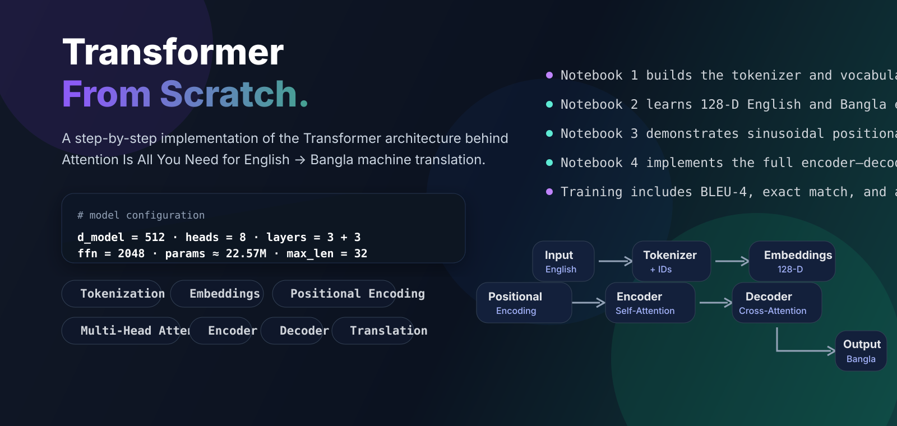

<div align="center">



</div>

This repository explains how a Transformer works by implementing its major components step by step, inspired by *Attention Is All You Need*. The project focuses on **English-to-Bangla neural machine translation** and is organized as a clear learning pipeline covering tokenization, learned embeddings, positional encoding, multi-head attention, and the final encoder–decoder Transformer.

[](https://www.python.org/)
[](https://pytorch.org/)
[](https://jupyter.org/)
[](#transformer-architecture)
[](#)
[](#)

## Why

Modern language models are built on the Transformer, yet the architecture often feels abstract when presented only through equations or high-level APIs. This repository makes the model more understandable by breaking it into four focused notebooks and implementing the important parts directly. The goal is not only to train a model, but also to understand the role of every stage in the pipeline.

## Repository Guide

| Section | Purpose |
|---|---|
| [Learning Path](#learning-path) | Follow the four notebooks in the intended study order |
| [Transformer Architecture](#transformer-architecture) | Understand the full model structure and flow |
| [Training and Evaluation](#training-and-evaluation) | Review optimization, metrics, and checkpoint behavior |
| [Repository Structure](#repository-structure) | See where the notebooks and artifacts are stored |
| [How to Run](#how-to-run) | Reproduce the project locally or in Google Colab |

## Learning Path

The repository is organized into four notebooks inside the **`notebooks/`** directory.

| Notebook | Focus | Core output |
|---|---|---|
| [`notebooks/1_tokenizer.ipynb`](notebooks/1_tokenizer.ipynb) | Text preprocessing and tokenization | Vocabulary, token IDs, padding, masks, decoder inputs |
| [`notebooks/2_embedding.ipynb`](notebooks/2_embedding.ipynb) | Learned token representations | 128-dimensional English and Bangla embeddings |
| [`notebooks/3_positional_encoder.ipynb`](notebooks/3_positional_encoder.ipynb) | Sequence-order information | Sinusoidal positional encoding demonstration |
| [`notebooks/4_transformer.ipynb`](notebooks/4_transformer.ipynb) | Full Transformer | Attention, encoder, decoder, training, evaluation, and translation |

### Notebook dependency

The notebooks are best studied in this order:

```text
1_tokenizer.ipynb
        ↓
2_embedding.ipynb
        ↓
3_positional_encoder.ipynb
        ↓
4_transformer.ipynb
```

The artifact dependency is slightly different:

```text
1_tokenizer.ipynb
        ↓
tokenized train / validation / test data
        ↓
2_embedding.ipynb
        ↓
trained 128-D embeddings
        ↓
4_transformer.ipynb

3_positional_encoder.ipynb
        ↓
standalone conceptual demonstration
        ↓
same positional-encoding idea is reimplemented inside 4_transformer.ipynb
```

## Transformer Architecture

The project implements an encoder–decoder Transformer for sequence-to-sequence learning.

### End-to-end flow

```text
English sentence
      ↓
Tokenizer
      ↓
Token IDs
      ↓
128-D word embeddings
      ↓
Projection to d_model = 512
      ↓
Sinusoidal positional encoding
      ↓
Transformer encoder
      ↓
Transformer decoder
      ↓
Bangla translation
```

### Model configuration

| Component | Configuration |
|---|---:|
| Source language | English |
| Target language | Bangla |
| Initial embedding dimension | 128 |
| Transformer model dimension | 512 |
| Encoder layers | 3 |
| Decoder layers | 3 |
| Attention heads | 8 |
| Feed-forward dimension | 2048 |
| Dropout | 0.10 |
| Maximum sequence length | 32 |
| Trainable parameters | ~22.57M |

### What each notebook teaches

#### 1. Tokenization

The first notebook prepares the dataset for the model by building English and Bangla vocabularies, converting text into token IDs, padding variable-length sequences, and preparing decoder inputs and masks. It uses standard special tokens such as `<PAD>`, `<UNK>`, `<BOS>`, and `<EOS>`.

#### 2. Embeddings

The second notebook learns 128-dimensional embeddings for both languages using **Skip-Gram with Negative Sampling**. These learned embeddings become the starting token representations used by the final Transformer.

#### 3. Positional Encoding

The third notebook demonstrates the sinusoidal positional encoding proposed in *Attention Is All You Need*. Its purpose is educational: it shows how a Transformer can represent token order even though self-attention itself is permutation-invariant.

#### 4. Full Transformer

The fourth notebook assembles the complete model. It loads the tokenized data and pretrained embeddings, projects them to 512 dimensions, applies positional encoding, and implements multi-head attention, encoder layers, decoder layers, feed-forward blocks, masking, training, evaluation, and translation generation.

### Core concepts implemented explicitly

- Word-level tokenization  
- Vocabulary construction  
- Dynamic padding and masks  
- Learned embeddings  
- Sinusoidal positional encoding  
- Scaled dot-product attention  
- Multi-head attention  
- Residual connections and layer normalization  
- Encoder self-attention  
- Decoder masked self-attention  
- Encoder–decoder cross-attention  
- Position-wise feed-forward networks  
- Greedy autoregressive decoding  

## Training and Evaluation

The final notebook trains the model using teacher forcing and evaluates it on held-out data.

### Training settings

| Setting | Value |
|---|---:|
| Batch size | 32 |
| Maximum epochs | 30 |
| Label smoothing | 0.10 |
| Dropout | 0.10 |
| Learning-rate scheduling | `ReduceLROnPlateau` |
| Gradient clipping | Enabled |
| Early stopping | Enabled |
| Checkpoint policy | Best validation-loss checkpoint |

### Metrics

The notebook tracks:

- Cross-entropy loss  
- Perplexity  
- Non-padding token accuracy  
- Validation loss  
- BLEU-4  
- Exact-match accuracy  

### Attention visualization

The final notebook also visualizes attention as a heatmap, making it easier to inspect how tokens interact during translation.

## Repository Structure

```text
transformer-from-scratch/
│
├── corpus/
│   └── Source corpus used by the project
│
├── notebooks/
│   ├── 1_tokenizer.ipynb
│   ├── 2_embedding.ipynb
│   ├── 3_positional_encoder.ipynb
│   └── 4_transformer.ipynb
│
├── tokenized_data/
│   └── Tokenized train / validation / test artifacts
│
├── trained_embeddings/
│   └── Saved English and Bangla embedding matrices
│
├── position_encoded_embeddings/
│   └── Saved outputs from the positional-encoding demonstration
│
├── assets/
│   └── transformer_hero.svg
│
└── README.md
```

The **`notebooks/` directory contains all four `.ipynb` files** used to teach the Transformer step by step. The other directories store the corpus and intermediate artifacts generated throughout the pipeline.

## How to Run

The notebooks are suitable for Google Colab or a local Jupyter environment.

### Recommended study order

```text
notebooks/1_tokenizer.ipynb
        ↓
notebooks/2_embedding.ipynb
        ↓
notebooks/3_positional_encoder.ipynb
        ↓
notebooks/4_transformer.ipynb
```

### Suggested workflow

1. Run the tokenizer notebook to prepare tokenized train, validation, and test data.  
2. Run the embedding notebook to train and save English and Bangla embeddings.  
3. Run the positional encoding notebook to understand how position information is represented.  
4. Run the Transformer notebook to train the full model and evaluate translation performance.  

## Reference

This project is inspired by:

**Vaswani, A. et al. (2017). _Attention Is All You Need_.**  
NeurIPS 2017.  
https://arxiv.org/abs/1706.03762

## Project Rationale

This repository is intended as a learning-first implementation of the Transformer. It does not aim to exactly reproduce the original paper’s full experimental setup. Instead, it focuses on making the architecture understandable by exposing the internal steps clearly and incrementally.

---

<div align="center">

**Transformer From Scratch**  
Educational implementation of the Transformer architecture for English-to-Bangla machine translation.

</div>
